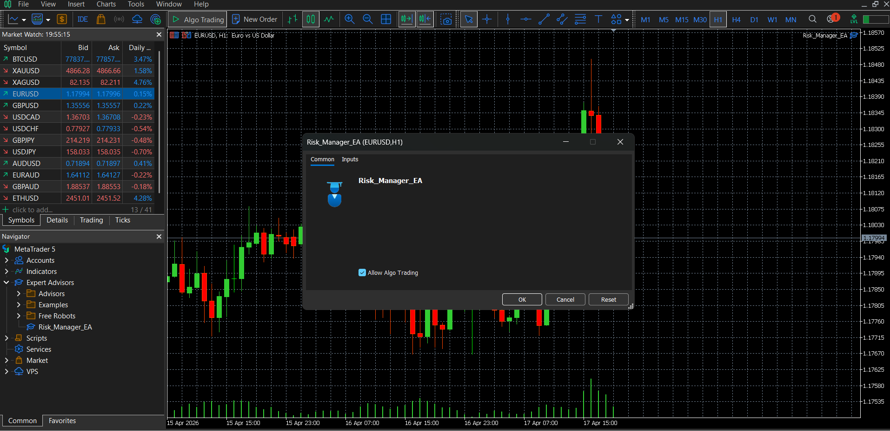

# MT5 Risk Manager EA

## 📌 Why I Built This

While trading manually, I noticed I was often risking inconsistent amounts per trade.
So I built this Expert Advisor to enforce strict risk management automatically.

The goal is simple: **risk a fixed percentage on every trade, no matter the market conditions.**

---

## ⚙️ What This EA Does

* Calculates lot size based on account balance and risk percentage
* Ensures consistent risk per trade
* Works with user-defined stop-loss
* Helps avoid over-leveraging and emotional trading

---

## 🧠 Core Logic

The EA uses a basic risk formula:

Lot Size = (Account Balance × Risk %) / Stop Loss

It dynamically adjusts position size so that each trade risks only the specified percentage of capital.

---

## 🛠️ Tech Stack

* MQL5 (MetaTrader 5)
* Algorithmic trading logic

---

## 🚀 How to Use

1. Copy the `.mq5` file into MetaTrader 5 → Experts folder
2. Compile using MetaEditor
3. Attach EA to a chart
4. Set:

   * Risk percentage
   * Stop-loss
5. Let the EA calculate lot size automatically

---

## 📸 Demo

*Risk Manager EA attached to EURUSD chart with Algo Trading enabled*

---

## ⚠️ Limitations

* Assumes manual stop-loss input
* No GUI panel yet
* Works best for standard forex pairs

---

## 🔧 Future Improvements

* Add GUI for easier control
* Auto-detect stop-loss from chart
* Integrate with trading journal

---

## 👨‍💻 Author

Yashraj Jare
